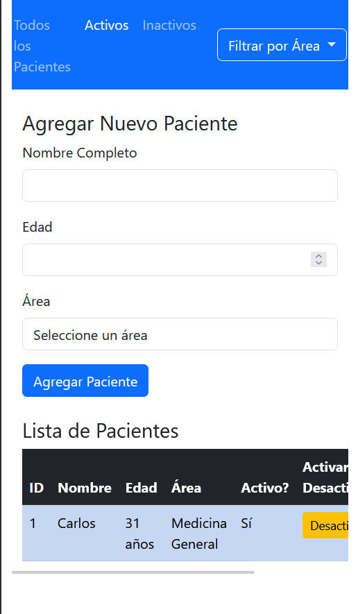
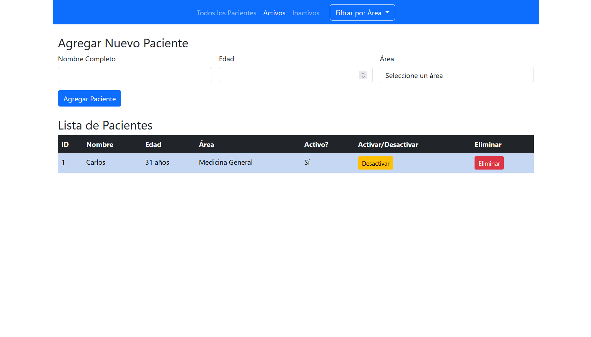

# PatientHandler

Sistema de gestión de pacientes desarrollado con Flask y SQLAlchemy

## Características

- **Gestión completa de pacientes (CRUD)**
  - Crear nuevos pacientes con información detallada
  - Visualizar lista de pacientes
  - Activar/desactivar pacientes
  - Eliminar pacientes (soft delete)

- **Interfaz web intuitiva**
  - Navegación sencilla entre diferentes vistas
  - Formulario para agregar pacientes
  - Tabla responsive para visualizar datos

- **Base de datos SQLite**
  - Almacenamiento persistente
  - Modelo relacional optimizado

- **API REST**
  - Endpoints para todas las operaciones CRUD

- **Filtros por estado y área**
  - Ver todos los pacientes
  - Filtrar solo pacientes activos
  - Filtrar solo pacientes inactivos
  - Filtrar por área médica específica
  - Combinar filtros de área y estado

## Campos del Paciente

- **ID**: Identificador único (generado automáticamente)
- **Nombre**: Nombre completo del paciente (requerido)
- **Edad**: Edad del paciente en años (requerido, 0-150)
- **Área**: Área médica asignada (requerido)
- **Estado**: Activo/Inactivo
- **Fecha de Creación**: Timestamp de creación automático

## Áreas Médicas Disponibles

- Pediatría
- Medicina General
- Cardiología
- Oftalmología

## Instalación y Ejecución

### Requisitos
- Python 3.12 o superior
- pip (gestor de paquetes de Python)

### Configuración del entorno virtual

1. **Crear el entorno virtual:**
```bash
python -m venv venv
```

2. **Activar el entorno virtual:**

En Windows:
```cmd
venv\Scripts\activate
```

En Linux/macOS:
```bash
source venv/bin/activate
```

3. **Instalar dependencias:**
```bash
pip install -r requirements.txt
```

### Ejecutar la aplicación

**Método recomendado** - Usando el script de inicio:
```bash
flask --app ./src/patient_handler/main run --debug
```

### Docker (Opcional)

Si prefieres usar Docker:
```bash
docker-compose up --build
```

## Uso

La aplicación estará disponible en `http://localhost:5000`

### Navegación Web

- **Todos los Pacientes** (`/patients/all`) - Muestra todos los pacientes no eliminados
- **Pacientes Activos** (`/patients/active`) - Muestra solo pacientes activos
- **Pacientes Inactivos** (`/patients/inactive`) - Muestra solo pacientes inactivos
- **Filtrar por Área** (`/patients/area/<area>`) - Muestra pacientes de un área específica
- **Área + Estado** (`/patients/area/<area>/active` o `/patients/area/<area>/inactive`) - Combina filtros

### API Endpoints

#### Pacientes
- `POST /api/v1/patients` - Crear nuevo paciente
  - Parámetros del formulario: `name`, `age`, `area`
- `POST /api/v1/patients/<id>/activate` - Activar paciente
- `POST /api/v1/patients/<id>/deactivate` - Desactivar paciente
- `POST /api/v1/patients/<id>/delete` - Eliminar paciente (soft delete)

## Tecnologías Utilizadas

- **Backend**: Python 3.12+, Flask
- **Base de Datos**: SQLite con SQLAlchemy 2.0.41
- **Frontend**: HTML5, Bootstrap 5, Jinja2
- **Containerización**: Docker & Docker Compose

## Capturas de la aplicación



